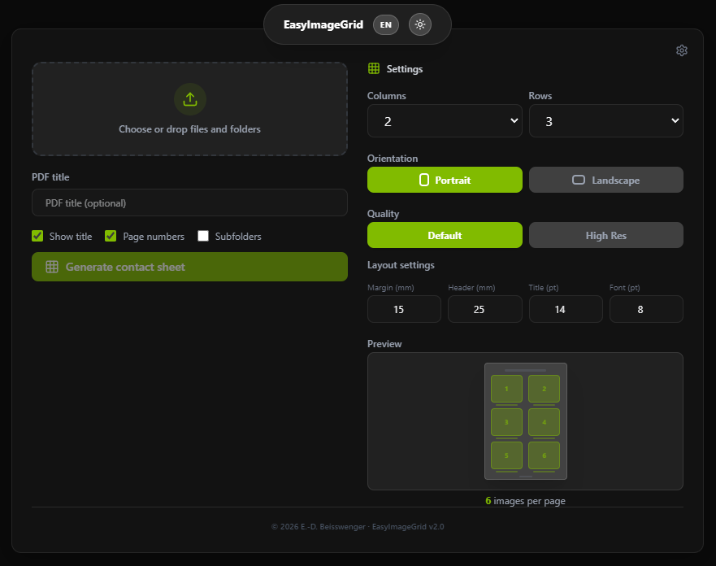

# EasyImageGrid

Easy Desktop app for generating PDF - contact sheets from images and folders. Pick a folder or drag-and-drop files, configure the grid layout, and get a print-ready A4 PDF with thumbnails and filenames. Faster and easier than Bridge or Lightroom.

It includes a couple of quality settings to play with or customize.

DISCLAIMER: This app was "Vibecoded" with Claude. What you see is what you get.



Built with Electron + React. PDF generation handled by a native AOT-compiled C# sidecar using SkiaSharp.

## Features

- Drag-and-drop files/folders or native folder picker
- Configurable grid (1-6 columns/rows), portrait/landscape
- Customizable quality presets with per-preset resolution (50–400%) and JPEG compression (1–100) — two factory presets plus up to 2 custom presets, configurable via a settings modal with factory reset
- Layout settings: adjustable page margin, header space, title and filename font sizes, with one-click defaults reset
- Recursive subfolder scanning with automatic section detection
- Three output modes: single PDF, sectioned PDF (one per subfolder heading), or separate PDF per folder
- Editable section names and per-folder/single-PDF toggle
- Live A4 preview that accurately mirrors PDF layout geometry, with estimated file size
- Per-image progress bar with cancel support
- Smart overwrite dialog (overwrite, keep both with auto-versioning, or cancel)
- Open PDF or reveal in Finder/Explorer on completion
- Dark/light mode (follows system preference)
- English/German language toggle with localStorage persistence (defaults to English)
- Full Unicode support for filenames and titles (including umlauts, accented characters)
- Supported formats: TIFF (including CMYK), JPEG, PNG, WebP, and RAW (CR2, CR3, NEF, ARW, DNG, ORF, RW2, RAF, PEF, SRW)

## Development

### Prerequisites

- Node.js 18+
- .NET SDK 9+ (for building the C# sidecar)

### Setup

```bash
npm install
npm run build:sidecar   # Build the C# sidecar binary (AOT, self-contained)
npm run dev
```

This starts Electron with Vite HMR for the renderer. The C# sidecar binary runs from `sidecar-cs/dist/` in dev mode.

## Build

```bash
# 1. Build the C# sidecar binary (must be done natively per platform)
npm run build:sidecar

# 2. Build the Electron app
npm run build

# 3. Package for distribution
npm run package:mac     # DMG (arm64)
npm run package:win     # NSIS installer
npm run package:linux   # AppImage
```

The sidecar is published as a self-contained AOT binary — no .NET runtime required on the target machine. Native libraries (libSkiaSharp) are bundled alongside the binary.

## How It Works

The app has three layers:

1. **React renderer** — UI with folder selection, grid/layout controls, progress display
2. **Electron main process** — native dialogs, file scanning, process management
3. **C# sidecar** — standalone native CLI that reads images and produces a PDF, reporting progress as JSON lines on stdout

The renderer communicates with the main process via IPC through a typed `window.electronAPI` bridge. The main process spawns the C# sidecar as a child process, passes configuration as CLI arguments, parses its JSON output, and forwards progress events to the renderer.

### Image Processing Pipeline

Two decode paths ordered by speed:

1. **SkiaSharp SKCodec** — JPEG/PNG/WebP with libjpeg-turbo scaled decode (1/2, 1/4, 1/8 native resolution)
2. **libtiff P/Invoke** — TIFF including CMYK via native C library (optional, best-effort)

Both paths use a unified two-step resize strategy: bilinear+mipmap bulk reduction to 2x target, then Mitchell-Netravali for the final crisp output. This produces consistent results across all input formats with minimal JPEG bloat in the PDF.

### PDF Generation Modes

| Mode | Trigger | Output |
|------|---------|--------|
| Single PDF | Default (no subfolders or "One PDF" selected) | One PDF with all images |
| Sectioned PDF | Recursive + multiple subfolders + "One PDF" | One PDF with section headers per subfolder |
| Per-folder PDFs | Recursive + multiple subfolders + "PDF per folder" | One PDF per subfolder, auto-named |

## License

Distributed under the MIT License.  
Feel free to use, modify, and share.

(c) 2026 E.-D. Beisswenger
